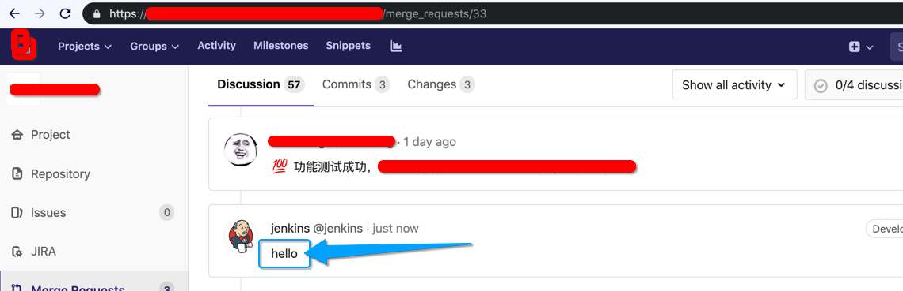

# gitlab_merge_request_add_note plugin

[](https://rubygems.org/gems/fastlane-plugin-gitlab_merge_request_add_note)

## Getting Started

This project is a [_fastlane_](https://github.com/fastlane/fastlane) plugin. To get started with `fastlane-plugin-gitlab_merge_request_add_note`, add it to your project by running:

```bash
fastlane add_plugin gitlab_merge_request_add_note
```

## About gitlab_merge_request_add_note

add merge request note for gitlab server api

**Note to author:** Add a more detailed description about this plugin here. If your plugin contains multiple actions, make sure to mention them here.

## Example

```ruby
gitlab_merge_request_add_note(
  host: 'https://git.in.xxx.com/api/v4',
  private_token: 'xxx',
  project_id: '16456',
  mr_id: '33',
  comment: 'hello'
)
```



## Run tests for this plugin

To run both the tests, and code style validation, run

```
rake
```

To automatically fix many of the styling issues, use
```
rubocop -a
```

## Issues and Feedback

For any other issues and feedback about this plugin, please submit it to this repository.

## Troubleshooting

If you have trouble using plugins, check out the [Plugins Troubleshooting](https://docs.fastlane.tools/plugins/plugins-troubleshooting/) guide.

## Using _fastlane_ Plugins

For more information about how the `fastlane` plugin system works, check out the [Plugins documentation](https://docs.fastlane.tools/plugins/create-plugin/).

## About _fastlane_

_fastlane_ is the easiest way to automate beta deployments and releases for your iOS and Android apps. To learn more, check out [fastlane.tools](https://fastlane.tools).
